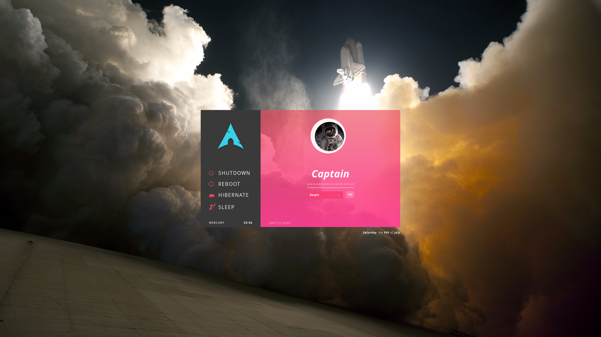

# Aether
###### ( lightdm-webkit-aether )
Inspired by a lifelong love with space. 

WIP. A Sleek, straightforward Archlinux themed login screen written on lightdm and the lightdm-webkit2-greeter.

## Requirements
- [lightdm-webkit2-greeter](https://github.com/Antergos/lightdm-webkit2-greeter)

##### Todo
- [ ] AUR Package
- [ ] Multi-user support
- [x] Full single-user support
- [x] Handle login errors more visibly.
- [ ] Dependency optimization, inline CSS
- [ ] Separate styling when used as a lock screen

##### Credit
- *Bear by Yu luck from the Noun Project*
- *Power by Nikita Kozin from the Noun Project*